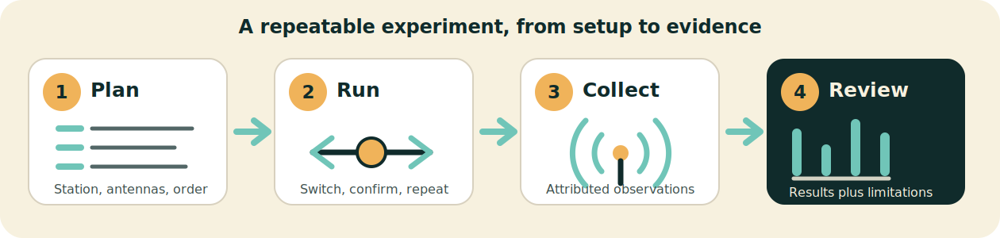

  

<h1 align="center">AntennaBench</h1>

<strong>Run repeatable antenna comparisons and keep the evidence behind every result.</strong>

Antenna tests are easy to start and surprisingly easy to overstate. Propagation
changes, receiver populations shift, switches happen late, and missing spots can
look like measurements when they are not.

AntennaBench is a local-first macOS desktop app that turns an antenna comparison
into a guided experiment. It helps you plan an interleaved WSPR run, prompts each
antenna change, collects attributed observations, and builds a report that shows
both the result and the limits of the evidence.

No account or hosted service is required. The portable session bundle on your
computer remains the durable experiment record.

  

## What AntennaBench Gives You

- **A repeatable run plan.** Define the station, antennas, band, direction, and
  number of repetitions before the experiment starts.
- **Operator-paced guidance.** Switch when ready; AntennaBench chooses the next
  valid WSPR cycle and records what actually happened rather than assuming the
  plan was followed perfectly.
- **Attributed evidence.** Keep local WSJT-X decodes, WSPR.live public spots,
  supported imports, notes, missed cycles, and corrections distinct.
- **Conservative reports.** Compare matched paths, inspect coverage and
  imbalance, and see why a stronger claim may not be supported. A missing spot
  is never silently treated as a zero-strength signal.
- **Portable records.** Export a standalone HTML report for reading or the full
  session bundle for archiving, reopening, and future analysis.

Optional local controller profiles can assist with antenna switching, but manual
operation remains the complete default workflow.

## Project Status

> [!IMPORTANT]
> AntennaBench is an early preview under active development. There is not yet a
> signed end-user download. The current desktop app is run from source on macOS
> 15 or later.

The local workflow can create and reopen sessions, conduct manual WSPR
comparisons, collect optional WSJT-X and WSPR.live evidence, import bounded WSPR
and Reverse Beacon Network data, render local reports, and export verified
reports and bundles. Automatic winner selection and hosted report publishing are
not available.

See the [roadmap](docs/roadmap.md) for the current direction.

## Documentation

For operators and evaluators:

- [How AntennaBench works](docs/product.md)
- [Session bundles and exported reports](docs/bundle-format.md)
- [Why WSPR is the default—and when to use RBN](docs/why-not-just-use-rbn.md)
- [Local antenna controller profiles](docs/antenna-controller-profiles.md)

## License

AntennaBench is licensed under the [Apache License, Version 2.0](LICENSE).
Copyright 2026 Robert Jackson.
