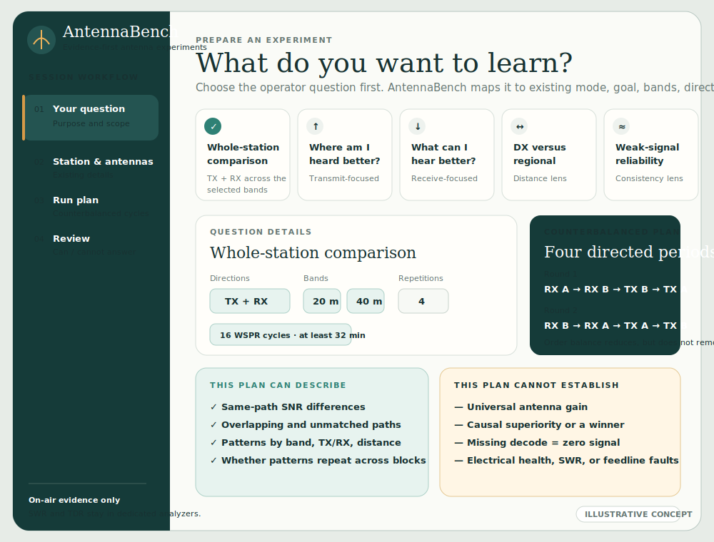
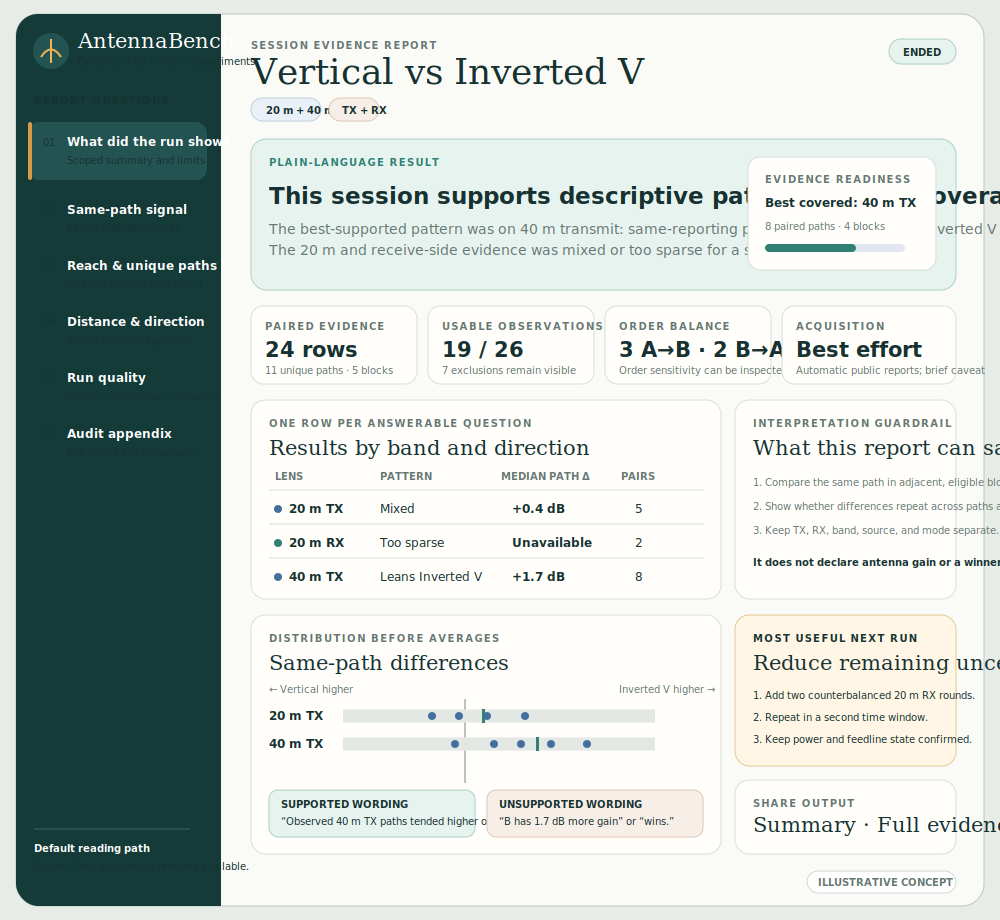
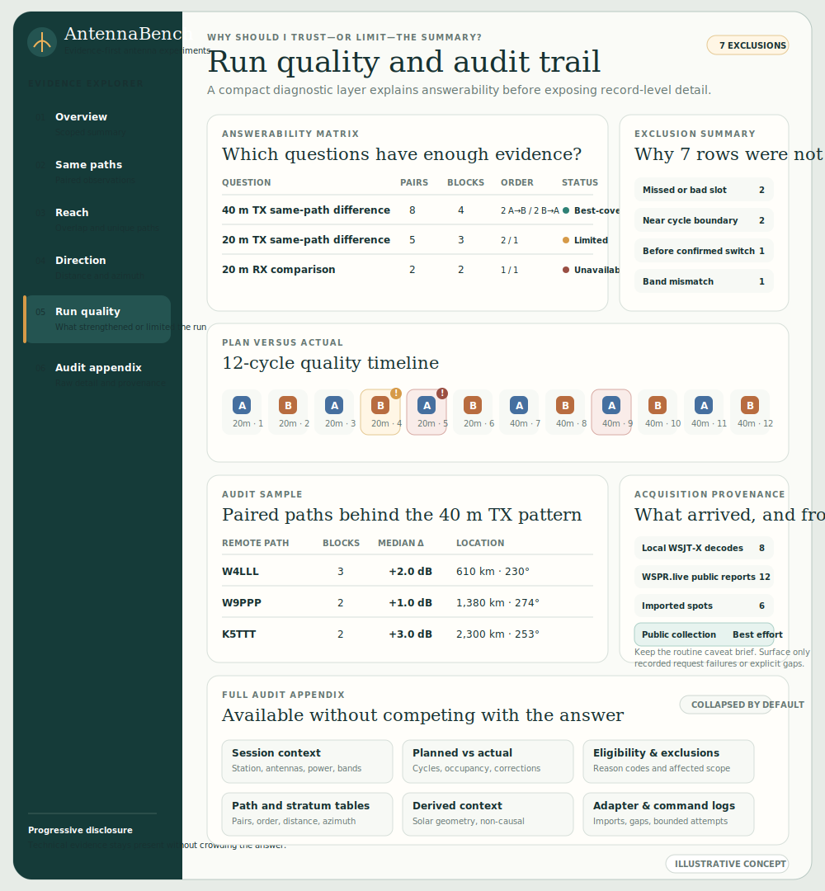

# Report output redesign mockups

These are illustrative planning artifacts for the report-output and question-first-setup issue track. The values are mock data and are not computed from the canonical session fixture.

## Product scope

AntennaBench compares on-air evidence. Electrical-health questions such as SWR, resonance, return loss, feedline faults, or TDR remain the job of dedicated analyzers such as a RigExpert or NanoVNA and are intentionally outside this track.

The concepts preserve the existing evidence boundary:

- lead with the operator's question and a scoped descriptive result;
- center same-path comparisons rather than raw spot totals;
- keep TX and RX, bands, modes, observation kinds, and sources separate;
- show what strengthened or limited the run without manufacturing a winner;
- retain the complete audit trail behind progressive disclosure;
- treat automatic public collection as best effort, with a restrained routine caveat and explicit disclosure only when a request failure or acquisition gap was actually recorded; and
- never convert missing detections into zero-SNR observations.

## Screens

### Question-first setup

### Answer-first report overview

### Run-quality and evidence explorer

## Semantic caution

The screenshots use per-stratum labels such as `moderate`, `weak`, and `insufficient` to demonstrate hierarchy. Production code must only show such labels if they come from an explicit deterministic coverage policy. Otherwise use raw counts and existing comparison-availability states.
