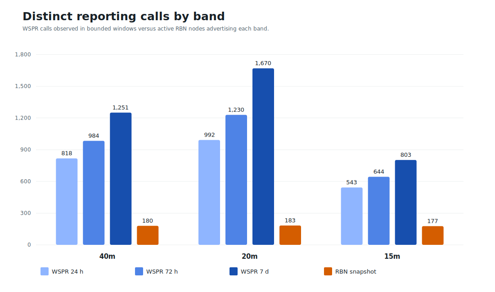
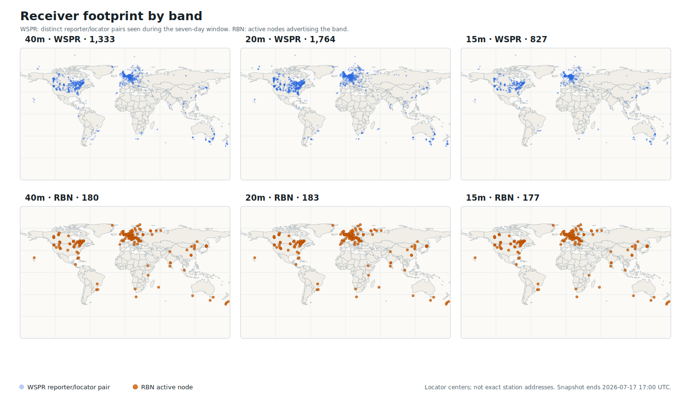
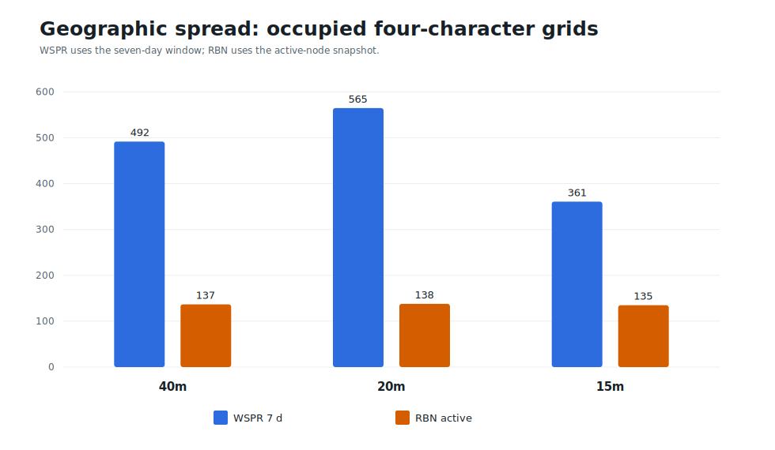

# Why not just use the Reverse Beacon Network?

For a CW operator, the Reverse Beacon Network (RBN) is the obvious alternative
to WSPR. It listens for the signal you actually transmit, reports quickly, and
can be an excellent antenna-testing tool.

AntennaBench does **not** treat RBN as inferior. It uses WSPR as the default
because the default experiment is intended to be repeatable across many paths
and usable by operators who do not send CW. RBN remains valuable for
controlled CW and RTTY work and, especially, for validating that a result still
holds for the signal you actually use on the air.

> **Use RBN when the question is:** “Where is my real CW signal being copied?”
>
> **Use WSPR when the question is:** “Across interleaved, matched trials, does
> antenna A consistently produce stronger or more complete evidence than
> antenna B?”

## They observe different things

An RBN CW spot is the end of a recognition pipeline. A skimmer must hear an
accepted keyword such as `CQ` or `TEST`, collect enough repetitions of the
callsign, and decode sufficiently clean code. Those requirements are useful for
finding stations that are calling CQ. They also mean that message construction,
keying quality, callsign recognition, decoder state, and duplicate suppression
can become variables in an antenna experiment.

WSPR starts with a more standardized test signal. Its messages carry a callsign,
locator, and reported power using a narrow-band, strongly coded waveform in
two-minute sequences. The WSJT-X documentation describes WSPR as a mode for
probing propagation paths and gives a nominal decoding threshold near -31 dB in
a 2500 Hz reference bandwidth. That does not make WSPR “better radio.” It
makes the stimulus easier to repeat while propagation and antennas are changing.

RBN is also not literally CW-only. Its standard spot feed carries CW and RTTY,
and a separate feed carries FT8 reports. The practical limitation is that node
capabilities vary, while the most uniform and familiar RBN path remains CW.

## What the current receiver populations look like

The old illustration for this page contained only a small WSPR sample. That was
not suitable for comparing network size. The current figures instead come from
bounded WSPR.live database queries over 24-hour, 72-hour, and seven-day windows,
plus a point-in-time pull of the RBN active-node endpoint.

<!-- BEGIN GENERATED RECEIVER SNAPSHOT -->
**Snapshot interval:** WSPR data from `2026-07-10T17:00:00Z` through `2026-07-17T17:00:00Z`; RBN active nodes fetched near the end of that interval.

| Band | WSPR calls, 24 h | WSPR calls, 72 h | WSPR calls, 7 d | RBN active nodes | 7-day WSPR / RBN |
| --- | ---: | ---: | ---: | ---: | ---: |
| 40m | 818 | 984 | 1,251 | 180 | 7.0× |
| 20m | 992 | 1,230 | 1,670 | 183 | 9.1× |
| 15m | 543 | 644 | 803 | 177 | 4.5× |

The all-HF WSPR queries found 1,466 distinct reporter calls in 24 hours, 1,825 in 72 hours, and 2,436 in seven days. The RBN endpoint returned 207 active nodes in its point-in-time snapshot.
<!-- END GENERATED RECEIVER SNAPSHOT -->



The longer WSPR windows are not intended to make the largest possible number.
They answer a different question: how many distinct reporting stations might be
available during an experiment that lasts hours or days? The 24-hour column is
the closest comparison to a current network snapshot, while the 72-hour and
seven-day columns show the additional receivers that appear intermittently.

The counts are not perfectly apples-to-apples:

- WSPR counts are distinct reporting callsigns seen during a time window.
- RBN counts are nodes online in one active-node snapshot and advertising the
  selected band.
- A callsign can move or report more than one locator, so the maps use distinct
  callsign/locator pairs while the headline table uses distinct callsigns.
- Neither count measures receiver quality, antenna performance, local noise, or
  continuous availability.

Even with those cautions, the original expectation was directionally correct in
this snapshot: WSPR exposed a materially larger receiver population on 40, 20,
and 15 meters. The difference was hidden by the earlier 49-point illustrative
sample, not by the underlying WSPR.live data.

## Geography matters as much as the total

A large receiver count does not guarantee useful geometry. Volunteer receivers
cluster around population centers, and both networks leave sparse regions.
The comparison below plots every recovered WSPR callsign/locator pair seen in
the seven-day window and every RBN node advertising the corresponding band.
Locations are plotted at the centers of reported Maidenhead locators, not exact
station addresses.



Raw station count can also exaggerate dense local clusters. A second useful
measure is the number of occupied four-character Maidenhead grid squares. It is
still imperfect, but it asks whether the network reaches more distinct regions
rather than merely containing more receivers in the same metropolitan areas.



For closer inspection, open the
[interactive band explorer](assets/why-not-rbn/receiver-network-band-explorer.html).
It can switch among 40, 20, and 15 meters, select the WSPR time window, and show
or hide either network.

## Why this affects an antenna comparison

### More paths reduce dependence on one receiver

A single remote receiver can be unusually quiet, noisy, directional, overloaded,
or temporarily misconfigured. A larger and more geographically varied reporting
population creates more opportunities for matched comparisons on the same
remote path. AntennaBench still treats each path separately; it does not assume
that 1,000 heterogeneous receivers form one calibrated instrument.

### WSPR gives the experiment a fixed cadence

AntennaBench can alternate antennas around WSPR's two-minute UTC sequence. That
makes it practical to interleave A and B frequently, reducing the risk that one
antenna is tested only before a band opening and the other only after it.

RBN can also support a disciplined comparison, but repeated CW transmissions
have an additional rule. RBN's own guidance says to move at least 300 Hz between
transmissions or wait ten minutes; otherwise a node that already spotted the
station may suppress the duplicate. This is not browser caching. It is a
reporting rule that must be included in the experiment design.

### A missing report is not a zero

For both networks, no spot means only that no qualifying report was observed. A
signal may have been below threshold, covered by interference, rejected by the
decoder, suppressed as a duplicate, lost during upload, or received by a station
that was not monitoring that band. AntennaBench therefore discloses missing and
unmatched observations rather than treating them as zero-strength signals.

### The SNR numbers are not interchangeable

RBN and WSPR use different waveforms, decoders, bandwidth conventions, and
reporting paths. An RBN SNR cannot be merged with a WSPR SNR as though both were
readings from one calibrated meter. Within either network, the strongest design
is a same-receiver, near-in-time A/B comparison with fixed power and settings.

## Where RBN is the better tool

RBN is often the better answer when the operating signal itself is part of the
question:

- checking where an actual CW CQ or contest exchange is reaching;
- verifying that keying and message construction are decoded reliably;
- making a quick beam-heading or band-opening check;
- validating a WSPR result in the mode you actually operate; or
- comparing antennas against a deliberately selected set of known skimmers.

For a controlled RBN test, use a memory keyer, keep the message and power fixed,
alternate antennas, record the exact frequencies, and either move at least 300 Hz
between adjacent transmissions or wait ten minutes. Compare paired reports from
the same skimmer over nearby times.

## Where WSPR is the easier default

WSPR is usually the easier default when the goal is a general-purpose antenna
experiment:

- the operator does not need to send CW;
- the transmitted waveform, message, and nominal power are standardized;
- the two-minute cadence supports frequent interleaving;
- weak-path decoding increases the number of observable paths; and
- the current public receiver population is substantially larger on the popular
  HF bands measured here.

WSPR is also better aligned with receive-side testing. Remote RBN spots describe
how other stations receive your transmission; they cannot measure your own
receive antenna. A local WSJT-X/WSPR decoding path can be switched with the
antenna and recorded as receive evidence.

## Practical choice

| Question | Better starting point |
| --- | --- |
| “Where is my normal CW CQ being heard right now?” | RBN |
| “Did changing beam heading improve my CW reports?” | RBN, with duplicate-suppression discipline |
| “Which antenna performs better over many automatically reported paths?” | WSPR |
| “I do not operate CW.” | WSPR, or another mode-specific reporting network |
| “Which receive antenna decodes more weak signals at my station?” | Local WSPR/WSJT-X evidence |
| “Does the WSPR result carry over to real CW?” | Use WSPR for the controlled test, then validate with RBN |

## Bottom line

“Why not just use RBN?” has a legitimate answer: sometimes you should. RBN is a
direct and useful measurement of real CW operating performance. WSPR is the
more convenient default for AntennaBench because it supplies a repeatable test
signal, a fixed cadence, receive-side options, and—in the measured 40, 20, and
15 meter snapshot—a much larger and broader reporting population.

The strongest workflow is often to use both: WSPR for the controlled A/B
experiment, then RBN for operational CW validation.

## Sources and reproducibility

- [AntennaBench product overview](product.md)
- [AntennaBench attribution and external-data policy](attribution.md)
- [RBN: How to get spotted](https://www.reversebeacon.net/pages/How%2Bto%2Bget%2Bspotted%2Bby%2Bthe%2BRBN%2B44)
- [RBN telnet services and mode streams](https://beta.reversebeacon.net/pages/Telnet%2Bservers%2B30)
- [WSJT-X user guide: WSPR](https://wsjt.sourceforge.io/wsjtx-main_en.html#WSPR)
- [WSPR.live database documentation](https://wspr.live/)

The exact snapshot rows, queries, current summary, map outline, and regeneration
script are installed under `tools/why-not-rbn/`. Run:

```sh
python3 tools/why-not-rbn/refresh_receiver_comparison.py --offline
```

to reproduce the charts from the included snapshot, or:

```sh
python3 tools/why-not-rbn/refresh_receiver_comparison.py --refresh
```

to make four bounded WSPR.live queries, fetch the RBN active-node list once, and
regenerate the snapshot, article table, static graphics, and interactive explorer.
The refresh path sleeps between WSPR.live requests and keeps every query bounded
by time and band.
